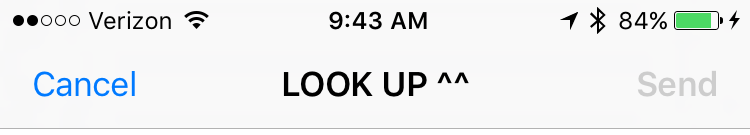
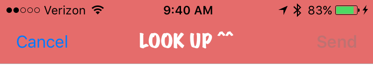
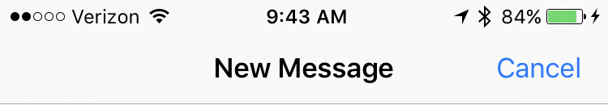
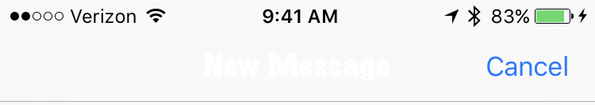

# Appearance Proxy Bug Proof

If you ever see an `MFMailComposeViewController` or `MFMessageComposeViewController` that looks really weird, but similar to the app that launched it, this is probably why. 

When you set an app-wide appearance proxy using `[UINavigationBar appearance]` instead of `[UINavigationBar appearanceWhenContainedInInstancesOfClasses:]`, it screws up the mail compose and message compose VC's nav bars. This persists even if you try to undo this setting by using `appearanceWhenContainedInInstancesOfClasses` for those two classes. 

You can see what happens when you try to do this using the "AppearanceProxyBugProof - Direct" scheme. Note that you have to run it on a device since these classes are no longer on the Simulator, so I added some screenshots here for your convenience.

The delightfully fugly look I'm setting using proxies: 

The mail compose VC correct:

and incorrect:

The message compose VC, correct

and incorrect: 

TL;DR on the workaround, which can be seen using the "Custom Nav" scheme: Create an otherwise-useless subclass of `UINavigationController`, and set your appearance proxy using `appearanceWhenContainedInInstancesOfClasses:` with your custom class. That prevents the system from accidentally hammering system level classes. 

Original November 2013 Radar: [http://openradar.appspot.com/radar?id=5225793009483776](http://openradar.appspot.com/radar?id=5225793009483776)

Updated November 2017 Radar: [http://openradar.appspot.com/radar?id=6165359065300992](http://openradar.appspot.com/radar?id=6165359065300992)